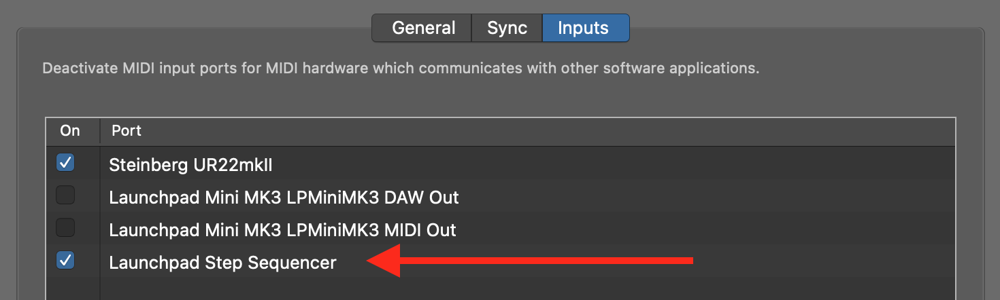

# Launchpad Step Sequencer
[](https://github.com/turbaszek/lss/actions/workflows/ci.yaml)

Command line tool allowing you to use
[Novation Launchpad Mini MK 3](https://novationmusic.com/en/launch/launchpad-mini)
as a step sequencer.

<!-- START doctoc generated TOC please keep comment here to allow auto update -->
<!-- DON'T EDIT THIS SECTION, INSTEAD RE-RUN doctoc TO UPDATE -->
- [Launchpad Step Sequencer](#launchpad-step-sequencer)

- [How it works](#how-it-works)
- [Installation](#installation)
- [Reference](#reference)

<!-- END doctoc generated TOC please keep comment here to allow auto update -->

## How it works

The `lss` handles bidirectional communication with your launchpad using MiDI protocol.
Communication is done using [mido](https://mido.readthedocs.io) (python midi wrapper).

When started `lss` creates new MiDI source named `Launchpad Step Sequencer`. This source
can be used as input in Logic Pro (or other DAW).



In Logic you may need to select
`Control Surfaces > Bypass All Control Surfaces` to avoid default mode of launchpad.

TODO: demo video

## Installation

To test locally run:
```sh
pip install -e ".[devel]"
```

Then start the sequencer by running `lss`.

## Reference

- [Novation Launchpad Mini MK3 programming guide](https://www.djshop.gr/Attachment/DownloadFile?downloadId=10737)
- [Mido documentation](https://mido.readthedocs.io)
